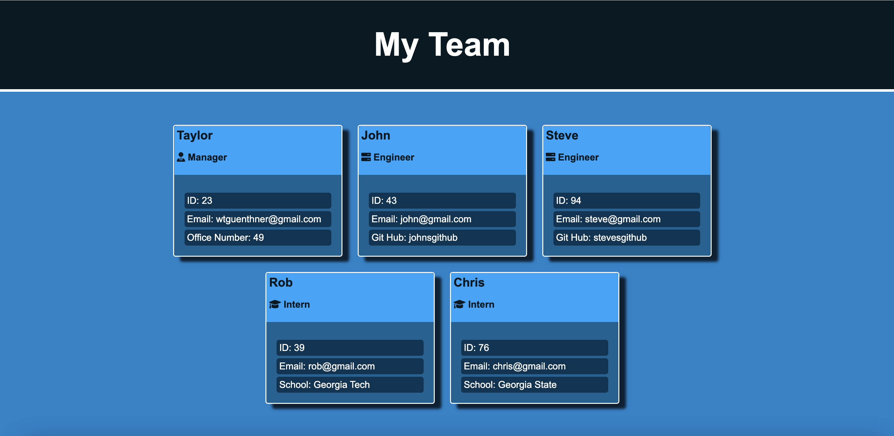

# Team Profile Generator

This application uses inquirer to gather users input for new employees and then creates an html page with styling to display all employees entered.


## Demo

[Application Video](https://drive.google.com/file/d/1EjWJC6nDVIPhxgMAN1T-EAWjS67M2G3N/view)


## Authors

- [@taylorguenthner](https://github.com/wtguenthner)


## Deployment

To deploy this project run

```bash
  node index.js
```


## Installation

Needed: Inquirer, Jest, [Babel](https://babeljs.io/setup#installation) (select Jest as the tool)

```bash
  npm i inquirer
  npm i jest
```
    
## Lessons Learned

This project required the understanding of object oriented programing which included constructing classes, inquirer and jest for creating application tests. 

## Running Tests

To run tests, run the following command

```bash
  jest
```


## Screenshots


